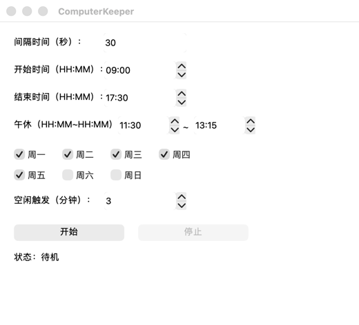

# ComputerKeeper

防止电脑休眠 / 保持企业微信、钉钉在线（macOS / Windows）。

扩展自 [GalokPeng/ComputerKeeper](https://github.com/GalokPeng/ComputerKeeper)，新增 macOS 完整支持，遵循 [MIT License](LICENSE)。

## 功能

- 设定时间段，让电脑保持活跃不掉线；可最小化到托盘后台运行
- 勾选周一至周日，只在勾选的日子生效（不勾选 = 仅当天有效）
- 只有电脑空闲超过设定阈值才激活，不影响正常工作
- 随机模拟 鼠标移动 / 滚轮 / Shift 刷新系统空闲计时（macOS 与 Windows 行为一致）
- macOS 增强：真实空闲检测、`caffeinate` 防休眠、原生合成输入

## 截图



## 快速开始（macOS）

```bash
git clone https://github.com/Wang-Fu-Gui-Er/ComputerKeeper.git
cd ComputerKeeper

# 安装依赖（macOS 自带 Python 3.9 即可）
/usr/bin/python3 -m pip install --user PyQt5 pyinstaller

# 打包（icon.icns 已内置；onedir 模式单进程，macOS 下 -F 单文件模式会是双进程）
PYTHONNOUSERSITE=0 pyinstaller -w --clean --noconfirm \
  --name ComputerKeeper --icon=icon.icns \
  --add-data "icon.png:." ComputerKeeper.py

# 运行
open dist/ComputerKeeper.app
```

不想自己打包？直接下载现成安装包（Apple Silicon）：

- [Releases 下载 ComputerKeeper-macOS-arm64.zip](https://github.com/Wang-Fu-Gui-Er/ComputerKeeper/releases/download/v1.0.0/ComputerKeeper-macOS-arm64.zip)，解压后拖入「应用程序」即可

> 提示：若报找不到 PyQt5/PyInstaller，一般是环境设置了 `PYTHONNOUSERSITE=1`，加 `PYTHONNOUSERSITE=0` 前缀即可。

## 使用

1. 设置参数后点「开始」（默认：间隔 30s、09:00–17:30、午休 11:30–13:15、周一至五、空闲触发 3 分钟）
2. 最小化窗口即驻留托盘；再次打开点 **Dock 图标**或托盘图标；停止点「停止」或托盘右键「退出」
3. 状态含义：
   - `待机（距空闲触发还需 X 秒）`：空闲达标后自动进入运行
   - `运行中（空闲触发）`：已空闲达标，正在周期微动 + 防休眠
   - `用户活动，已暂停` / `午休中`：你回到电脑前或午休时段，自动暂停

## Windows（原版）

```powershell
pip install PyQt5 pyinstaller
pyinstaller -F -w --icon=icon.ico --add-data "icon.png;." .\ComputerKeeper.py
```

## 常见问题

- **状态数字不递减？** 该数字 = 空闲阈值 − 当前连续空闲秒数。你在操作时它会停在阈值附近，停止操作后才会每秒递减到 0 触发。
- **会打扰我工作吗？** 不会。只有空闲超过阈值后才每 30 秒微动 1 像素，操作期间完全不动。
